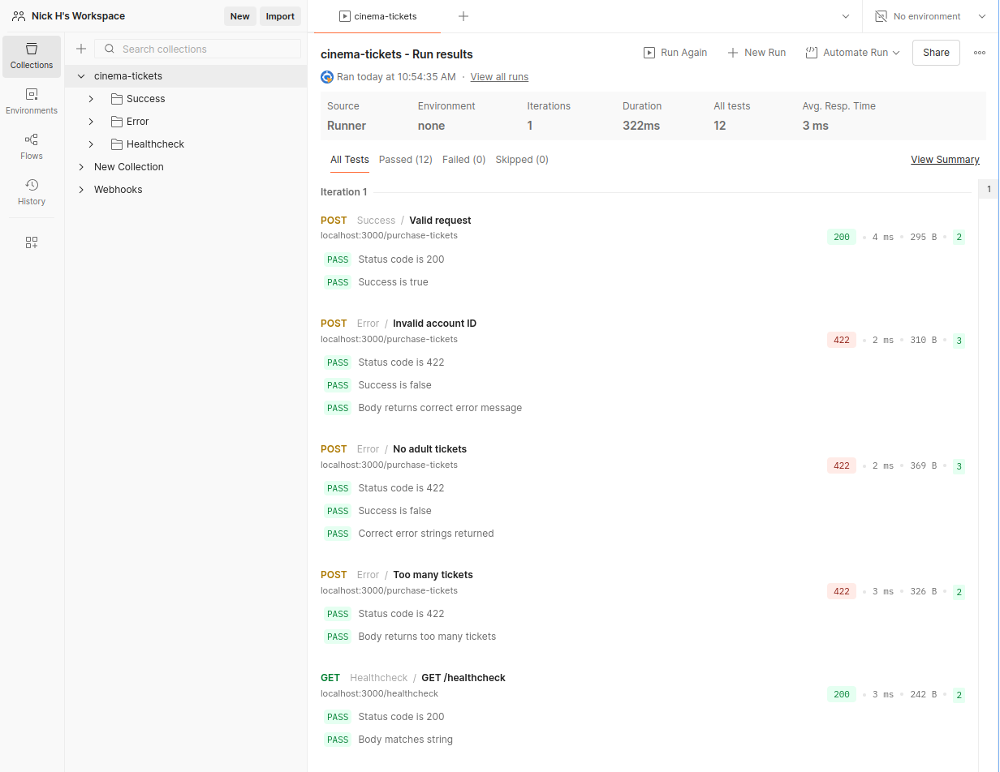

# Cinema Tickets

See [task description](./TASK.md) to view the problem statement.

## 🏃 Running Instructions 🏃

I have provided a very minimal Express app for the purpose of running a small end-to-end test collection.

The app can be ran with:

```
npm i
npm start
```

Please note that I have provided a runnable app simply as a utility for testing, rather than as a showcase for my coding style or ability, so for that please see the rest of my code!

## 📋 Testing Instructions 📋

### Unit Tests

Unit tests can be run by first cloning this repository, then running:

```
npm i
npm test
```

### End-to-end Tests

With a running app (see above) and a Postman account, you may import the collection at `test/e2e/cinema-tickets.postman_collection.json` and run a small suite of e2e tests. They are by no means comprehensive but cover the happy path and a couple of validation error cases, both for account and ticket logic.

I have provided a screenshot of the Postman collection run if the reviewer does not have Postman available:



## 🤔 Assumptions 🤔

I have assumed that the number of infant tickets must not exceed the number of adult tickets, due to the statement 'They will be sitting on an Adult's lap'. However, I am assuming that infant tickets **do not** count towards the maximum number of seats in the booking, since they do not take up an additional physical seat. I've made this assumption as this is something that I would challenge in the requirements in a real-world project, because I believe the intention of this code is to manage the number of _seats_ (and the payment for said seats), rather than managing tickets specifically.

Because the seat reservation and payment services are to be treated as having no defects, I have not considered any logic behind the ordering or synchronising of calls to these services. In a real world application, I would of course probe the business logic here (e.g. can tickets only be reserved once payment has been taken? can both calls be made concurrently? do we need to define compensation functions for each service call in case the other fails and we have to roll back a side effect? etc.).

## 💅 Code Style 💅

I'm more familiar with functional JavaScript/TypeScript but I've done my best to write what I think is idiomatic Object-Oriented JavaScript. I have used dependency injection in constructors for composability and ease of testing, and factored out logic into separate services. I have used the provided `TicketService.js` largely as an orchestration service for calls to the other services to maintain readability and single-responsibility services.

I have also used extensive logging to ensure ease of (theoretical) debugging.
